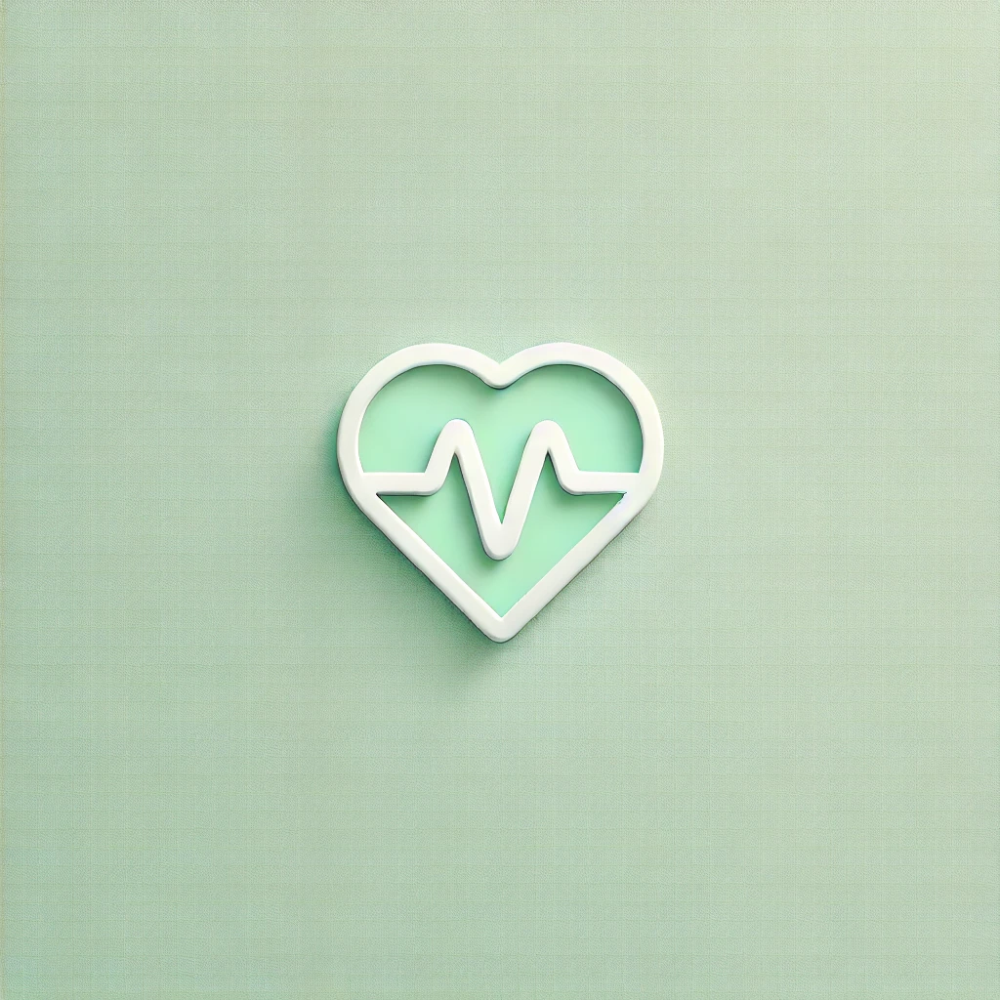

#

# 
OpenAI_Status_Reader

> 김해중 개인 프로젝트
>
> 개발기간 : 2024. 08. ~ 09.
>
> 크롬스토어 최초 게시 : 2024.09.02.
>
> 마지막 업데이트 : 2024.09.04.

## 🛠️참여자

<td align="center">
<a href="https://github.com/KimHaejoong1">

 
<b>KimHaejoong1</b>
</a>
 
</td>

## 프로젝트 소개

간편하고 빠른 설치를 통해 서비스 상태에 대한 실시간 정보를 손쉽게 확인할 수 있습니다. 먹통이 된 ChatGPT가 왜 그런지 이유라도 알 수 있습니다.

 

OpenAI에서 제공중인 status는 일반 사용자들에게는 직관적으로 현재 문제가 있는지 없는지 판단하기에는 조금 힘든 디자인을 가지고 있습니다. 아주 간단하게, 현재 작동중인지 여부만을 보여주는 서비스를 제공함으로써 사용자로하여금 좀 더 편리한 서비스의 이용이 가능해집니다.

 
 

A simple and quick installation allows you to easily check real-time information about OpenAI's status. It helps you understand why ChatGPT or OpenAI services may have stopped working.

 

The status page provided by OpenAI is not designed for general users to easily determine whether there is an issue with the current service. By offering a simple service that only shows whether the service is currently operational, users can access the service more conveniently.

## 📦기술 스택

#### Environment

 

#### Development

  
